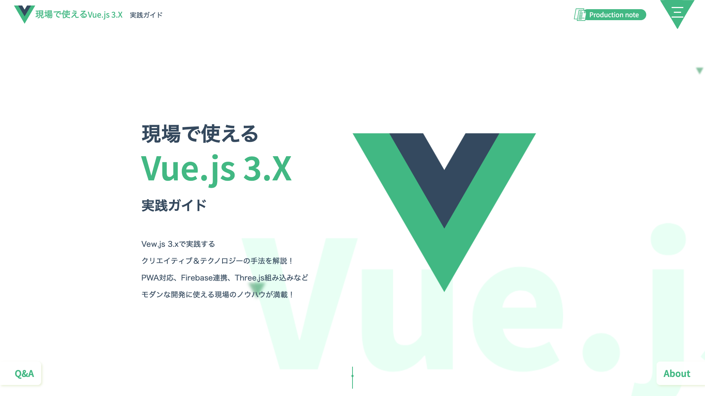

#「現場で使えるVue.js 3.X 実践ガイド（C&R研究所）」サンプルファイルと補足

この度は「[現場で使えるVue.js 3.X 実践ガイド](https://www.c-r.com/book/detail/1413) 」をご購入いただき、ありがとうございます。こちらではサポートページの一部としてサンプルコードの公開と補足をしています。

##[DEMO](https://vue3.mon.st/)

**サンプルコードや説明は随時更新されています。学習の際は常に最新のものをご利用ください。**  
※下記の動作環境の通りGoogle Chromeにて動作の検証を行っておりますので、Google Chromeでご覧ください。

まだ書籍を購入していない方で購入をご希望の方は、一般の書店もしくはネット書店 [Amazon](https://www.amazon.co.jp/dp/4863543522) 、[HMV&BOOKS online](https://bit.ly/3w3xdgY) 、[楽天ブックス](https://books.rakuten.co.jp/rb/16729323/) 、[ヨドバシ.com](https://www.yodobashi.com/product/100000009003430352/)  よりご購入ください。

## 動作環境

- ブラウザ：[Google Chrome](https://www.google.co.jp/chrome/)
- デバッグ環境：[Chrome拡張版 Vue.js devtools](https://chrome.google.com/webstore/detail/vuejs-devtools/ljjemllljcmogpfapbkkighbhhppjdbg)
- エディタ：[Visual Studio Code](https://azure.microsoft.com/ja-jp/products/visual-studio-code/)

### サンプルの動作確認バージョン

- Node.js：v14.15.5
- npm：6.14.11
- Yarn：1.22.5
- Vue CLI：4.5.10
- vue：3.0.5

## サンプルの使い方

セクションごとに使用しているパッケージモジュールが異なりますので、それぞれ``yarn install``を実行してモジュールをインストールします。  
【017.WordPressと連携する】ではDockerを使用してWordPress環境を構築しますが、``chapter03-017.zip``にはサンプルとは別にDockerでのWordPress環境構築に必要な環境ファイルを同梱しています。書籍の内容に沿ってお使いください。  
【019.Firebaseと連携する】で使用する``apiKey``などの設定値はダミーになっています。書籍の内容に沿ってアプリケーション登録し各自の設定値をお使いください。

## ダウンロード

サンプルはCHAPTER、セクションごとにブランチを分けて公開しています。それぞれのコードをダウンロードする場合は以下を参照してください。  
ファイル名はブランチ名と一致しています。

### CHAPTER 01 ベースとなる知識の確認〜導入編

| セクション | ファイル |
|:-----------|:------------|
| 001.開発ツールを準備する |  |
| 002.開発環境を準備する |  |
| 003.Vue.jsの概要を知る |  |
| 004.ディレクティブを確認する |  |
| 005.ルーティングと状態を制御する |  |

CHAPTER 01はサンプルの動作に必要な環境とVue3.xの概要の解説になりますのでサンプルはありません。

### CHAPTER 02 ベースとなるWebサイトの作成〜基本編

| セクション | ファイル |
|:-----------|:------------|
| 006.Vue.jsを利用したWebサイト構築の流れを確認する |  |
| 007.Webサイトの要件定義・画面設計を決める |  |
| 008.Vue.jsを設計する |  |
| 009.コンポーネント構成を設計する |  |
| 010.ルーティングを設定する |  |
| 011.ページ共通のコンポーネントを作る |  |
| 012.各ページコンポーネントをつくる |  |
| 013.状態を管理する |  |
| 014.Webサイトを整える | [chapter02.zip](https://github.com/monsterdive-web-div/vue3x_books/archive/refs/heads/chapter02.zip) |

### CHAPTER 03 機能的なWebサイトの作成〜実践編

| セクション | ファイル |
|:-----------|:------------|
| 015.開発環境の準備 |  |
| 016.外部のJavaScriptライブラリを使おう | [chapter03-016.zip](https://github.com/monsterdive-web-div/vue3x_books/archive/refs/heads/chapter03-016.zip)  |
| 017.WordPressと連携する | [chapter03-017.zip](https://github.com/monsterdive-web-div/vue3x_books/archive/refs/heads/chapter03-017.zip) |
| 018.Webサイトをアプリ化する（PWA） | [chapter03-018.zip](https://github.com/monsterdive-web-div/vue3x_books/archive/refs/heads/chapter03-018.zip) |
| 019.Firebaseと連携する | [chapter03-019.zip](https://github.com/monsterdive-web-div/vue3x_books/archive/refs/heads/chapter03-019.zip) |
| 020.機能を拡張する（Vueプラグイン、ライブラリの紹介） | [chapter03-020.zip](https://github.com/monsterdive-web-div/vue3x_books/archive/refs/heads/chapter03-020.zip) |

CHAPTER 03以降のファイルはCHAPTER 02をベースにブラッシュアップしたものでそれぞれで完結しています。  

### CHAPTER 04 魅力的なWebアプリの作成〜応用編

| セクション | ファイル |
|:-----------|:------------|
| 021.アニメーションの種類 |  |
| 022.SVGアニメーションと連携しよう | [chapter04-022.zip](https://github.com/monsterdive-web-div/vue3x_books/archive/refs/heads/chapter04-022.zip) |
| 023.Canvas/WebGLと連携する | [chapter04-023.zip](https://github.com/monsterdive-web-div/vue3x_books/archive/refs/heads/chapter04-023.zip) |

[DEMO](https://vue3.mon.st/) にて公開しているものは各セクションのものをマージ、一部調整したものとなり、[main.zip](https://github.com/monsterdive-web-div/vue3x_books/archive/refs/heads/main.zip) からダウンロードできます。

### [DEMO](https://vue3.mon.st/) （ [main.zip](https://github.com/monsterdive-web-div/vue3x_books/archive/refs/heads/main.zip) ）に組み込まれている内容

- Newsの記事を外部JSONから読み込み【016】
- WordPressとは未連携。Newsの外部JSONに記事詳細のデータを入れNews詳細を表示【017】
- Webサイトをアプリ化（PWA）【018】
- Firebaseと連携、OpenID認証。プッシュ通知は未組み込み【019】
- AboutページのカルーセルをSwiperで実装【020】
- SVGアニメーションと連携【022】
- Canvas/WebGLと連携【023】

## 本書に対する思い・こだわり

「[「現場で使えるVue.js 3.X 実践ガイド」を執筆しました](https://www.monster-dive.com/blog/web_creative/20210720_002035.php) 」にて公開中ですのでぜひご覧ください。

## 執筆

[MONSTER DIVE](https://www.monster-dive.com/)  WEBプロダクション事業部

## 免責事項

サンプルについて、一般的な環境においてはとくに問題のないことを確認しておりますが、万一障害が発生しその結果いかなる障害が生じたとしても、小社および著者はなんら責任を負うものではありません。また生じた障害に対する一切の保証をいたしかねます。必ずご自身の判断と責任においてご利用ください。

## 著作権

サンプルは著作権法上の保護を受けています。収録されているファイルの一部、あるいは全部について、いかなる方法においても無断で複写・複製・再配布することは禁じられています。

